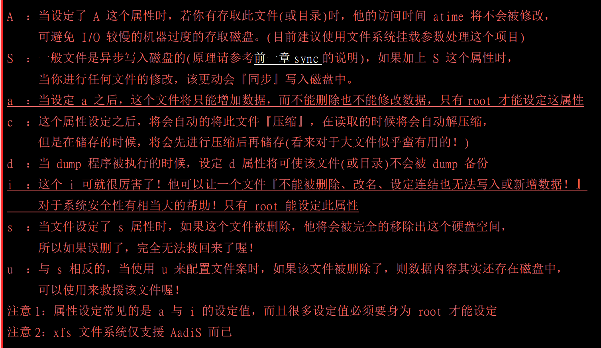

# Linux鸟哥私房菜

### 第一章

### 第二章

### 第三章

### 第四章

```shell
## 当前用户退出 linux
exit

## 完整日期时间
date
# 日期 格式 2019/2/18
date +%Y/%m/%d
# 时间 格式 09:42
date +%H:%M

## 日历指令
cal
# 显示2017年所有月份
cal 2017
# 显示2017年5月
cal 5 2017

## 计算器指令： +（加法），-（减法），*（乘法），/（除法），%（取余），^（次方）
# 进入计算器
cal
# 退出计算器

quit

## --help 帮助文档
date --help
cal --help

## man 文档说明, q: 退出文档
man date
man cal

## info 文档说明，q: 退出文档
info info 
info date

## 正确的关机方式
# 立刻关机
shutdown -h now
# 系统在今天20:25分关机，如果在20:25以后下达的指令，那就是隔天20:25分关机
shutdown -h 20:25
# 十分钟后自动关机
shutdown -h +10
# 立刻重启
shutdown -r now
# 30分钟后重启，并且显示信息给，其他在登录状态的用户，
shutdown -r +30 '系统会在30分钟后重启，请赶快保存'
# 仅发出警告。系统并不会真的关机
shutdown -k now '系统马上要关机了，请赶快保存'

## halt 系统停止，屏幕可能会保留系统以及停止的信息
halt

## poweroff 系统关机，所以没有提供额外的电力，屏幕空白！
poweroff

## systemctl 关机指令
# 重启
systemctl reboot
# 关机
systemctl poweroff

```


### 第五章

需要理解的概念。1.拥有者。2.群组。3.其他人(非拥有和群组之外的人)

**拥有者：**

文件的拥有者，例如：我（小毛）有一封情书放在我的房间，我就是这个情书的拥有者，除了我之外谁也无法，查看，修改，删除这个封情书。只有我把房间的钥匙给别人，也就是授权给别人。

**群组：**

多个人都有某个文件的操作权限。如：王家有三兄弟，大毛，二毛，小毛。他们都有自己独立的房间。也有公共的客厅，都可以在客厅看电视，玩手机。这个客厅就是群组，大毛，二毛，小毛就是群组的成员。所以可以在客厅做自己事情。

**其他人：**

非拥有和群组之外的人。如：张三是张家的人，所以没有王家的钥匙。但是他想看我的情书，那他就需要跟我做朋友。得到我的授权，才可以。而张三就是：其他人。

**万能的神：**

Linux中有一个万能的神，那就是root，他无所不能，想看情书就可以看，可以为所欲为。


**Linux文件属性**


**先看红色框框**

-rw------.:  表示文档类型权限

1 :  连接数

第一个 root :  文档拥有者 test用户

第二个root：文档所属群组

0 ： 表示文档大小，默认单位：bytes

2月 18 09:25  ： 表示2月18日 9:25 是最后修改的日期

yum.log：表示文档名称


**看黄色框框**

d: 目录 ，r：读，w：写，x：执行


第一个字符代表文档类型：

**d**: 目录

**-**：文件

**l** ： 连结文档

**b** ： 表示为装置文件里面的可供存储的接口设备

**c**  :  表为串行端口设备，如键盘，鼠标  

接下来的字符中，以三个为一组：且均是[ r w x] 的三个参数组合

r ：读(read)    w ：写(write)    x : 执行(execute) 。这三个权限的位置不会发生变化。没有权限 - 代替

第一组：文档拥有者权限

第二组：文档所属群组权限

第三组：其他人权限

**修改文档权限**

```shell
## 修改文档所属群组 chgrp -R 群组名称 文件名称。-R 可以不加，加上表示递归变更，整个目录下所有文件
chgrp -R users test

## 改变文件拥有者 chown -R 账号名称 文件或者目录。-R 可以不加，加上表示递归变更，整个目录下所有文件
chown -R root test

## 改变文件权限，
# 数字形式 r:4  w:2  x:1
# owner = rwx = 4+2+1 = 7
# group = rwx = 4+2+1 = 7
# others = --- = 0+0+0 = 0
chmod 700 文件或者目录
# 也可以这样写
chmod -R xyz 文件或者目录
# 还可以用这样写。u:拥有者，g：群组，o ：其他人
chmod u=rwx,g=rw,o=rw 文件名称
# 去掉权限（作用于：拥有者，群组，其他人）
chmod a-rwx 文件名称
# 添加读写权限（作用于：拥有者，群组，其他人）
chmod a+rw 文件名称
```


### 第六章

**目录操作**

```shell
.			# 代表此层目录
..			# 代表上一层目录
-			# 代表前一个工作目录
~			# 代表【当前用户身份】所在的家目录
~account 	# 代表account这个用户的家目录(account就是账号名称 如：~root)

cd  		# 变换目录
cd .. 		# 去上一层目录
cd - 		# 去前一个工作目录
cd ~ 		# 去【当前用户身份】所在的家目录
cd /home 	# 去/home这个目录

pwd			# 显示当前目录

mkdir 		# 建立一个新的目录
mkdir test	# 建立一个新的test目录
mkdir -p test1/test2/test3	# 级联建立目录
mkdir -m 711 test4	# 新建目录时并且预设权限。如果没有加 -m 就是默认权限

rmdir		# 删除一个空目录
rmdir test  # 删除名为test的空目录
rmdir -p test/test1  # 级联删除空目录
```

**文件与目录管理**

```
ls # 文件显示 常用命令。
ls -a  # 显示全部文件，包括隐藏文件
ls -A  # 显示全部文件，但是不包括【.】和【..】这两个目录
ls -d  # 仅列出目录本身，而不是列出目录中的文件
ls -l  # 长数据串行，包含文件的属性和权限等信息： 简写： ll

cp # 文件拷贝 常用命令
cp t1 /home/t2  # 拷贝当前目录中的t1到/home目录下，并且更改名称为t2
cp t1 t2 t3 /home # 拷贝当前目录中的t1,t2,t3到/home目录下
cp -i t1 /home/t2  # 拷贝当前目录中的t1到/home目录下，更改名称为t2。如果home下有t2 就覆盖
cp /home/t2 .      # 拷贝/home/t2下的t2 到当前目录
cp -r /tmp/test1/ /tmp/test2 # 拷贝test1这个目录，到test2目录下

rm # 文件删除
rm -f   		# force的意思。忽略不存在的文件。不会出现警告信息
rm -i   		# 互动模式。在删除前会询问使用者是否确定
rm -r   		# 递归删除，最常用在目录的删除，这是一个非常危险的选项！！！

mv # 文件移动，或者更改名称
mv -f			# force 强制的意思，如果目标文件以及存在，不会询问而直接覆盖
mv -i			# 若目标文件，已经存在时，就会询问是否覆盖
mv -u			# 若目标文件以及存在，且source比较新，才会更新

# 路径截取。在shell scripts 里面常用
basename /etc/sysconfig/network   # 后缀、得到 network
dirname /etc/sysconfig/network   # 前缀，得到 /etc/sysconfig

# 文件内容查阅
cat 			# 由第一行开始显示文件内容 
tac 			# 从最后一行开始显示，可以看出 tac 是 cat 的倒着写！
nl 				# 显示的时候，顺道输出行号。
more 			# 一页一页的显示文件内容
less 			# 与 more 类似，。但是比more 更好，可以往前翻页
head 			# 只看头几行
tail			# 只看尾巴几行
od				# 以二进制的方式读取文件内容！

```

**修改文件时间和新建文档**

**modification time （mtime）**

当文件的【内容数据】变更时，就会更新这个时间！内容数据，就是文件的内容

**status time （ctime）**

当该文件的【状态】改变的时，就会更新这个时间，例如：文件的权限或者属性被更改了，就会更新这个时间

**access time (atime)**

当【该文件的内容被取用】是，就会更新这个读取的时间；列如：我们使用cat去读取/etc/man_db.conf 。就会更新这个时间

```shell
touch [-acdmt] 文件名称
#参数：
# -a ： 仅修改 access time 
# -c ： 仅修改文件的时间，如果该文件不存在，则不建立新文件
# -d ：后面可以接想要修改的日期，而不用当前日期。也可以用 --data="日期或者时间"
# -m ：仅修改 mtime
# -t ：后面可以接欲修改的时间而不用当前的日期。格式为[YYYYMMDDhhmm]

```

**文件预设权限：umask**

```shell
umask # 与一般权限有关的是后面三个数字
0022

umask -S 
u=rwx,g=rx,o=rx

```

**文件隐藏属性**

```shell
chattr [+，-，=] [ASacdistu] 文件或者目录名称
+  ：添加某一个特殊参数，其他参数不变
-  ：移除某一个特殊参数，其其他参数不变
=  ：设置参数，后面接受参数
```



```shell
lsattr # 显示文件隐藏属性
-a  # 将隐藏文件的属性也显示出来
-d  # 如果接的是目录，仅列出目录本身的属性而非目录内的文件名
-R  # 连同子目录的数据也一并列出来
```

**执行文档查找**

```shell
which # 寻找【执行档】
which [-a] command
-a # 将所有由PATH目录中可以找到的指令均列出，而不止第一个被找到的

列:
which which     # 查询which在哪个目录下
```

**文档名搜索**

```shell
whereis # 由一些特定的目录中寻找文件
whereis [-bmsu] 文件或者目录名
-l		# 列出whereis会去查询的几个主要目录
-b		# 只找 binary 格式的文件
-m		# 只找在说明文件 manual 路径下的文件
-s		# 只找 source 来源文件
-u		# 搜寻不在上述三个项目当中的其他特殊文件
例:
whereis passwd  # 全部的档名都列出来

whereis -m passwd #只有在 man 里面的档名才列出


locate [-ir] keyword # 我最新版本CentOS 7.6 没有这个命令
-i   #  忽略大小写
-c   # 不输出档名，仅计算找到文件数量
-l   # 仅输出几行的意思。列出输出五行则是 -l 5
-S   # 输出 locate 所使用的数据库文件的相关信息，包括该数据库记录的文件/目录数量等
-r   # 后面可以接正规表示法的显示方式

find # 全磁盘搜索，比较耗时间
find [PATH] [option] [action]
1. 与时间有关的选项：共有 -atime , -ctime , -mtime 
以 -mtime 说明：
	-mtime n : n 为数字，意义为在n天之前的 【一天之内】被更改过内容的文件档名
	-mtime +n ：列出在n天之前（不含n天本身）被更改过内容的文件档名
	-mtime -n : 列出在n天之内（含n天本身）被更改过内容的文件档名
	-newer file ：file为一个存在的文件，列出比file还要新的文件档名
列:
find / -mtime 0 # 将过去系统上面24小时内有过改变内容。的文件列出

find /etc -newer /etc/passwd  # 寻找/etc 地下的文件，如果文件日期比 /etc/passwd 新，就列出


```


### 第七章

### 第八章

### 第九章

### 第十章

